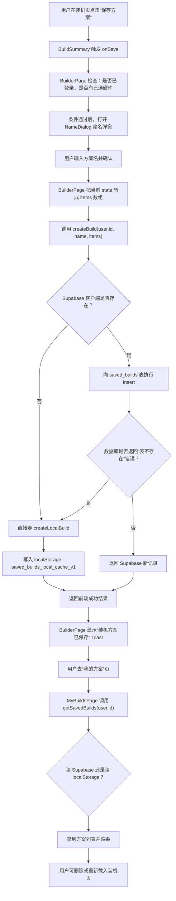

```mermaid
flowchart TD
  A["用户在装机页点击“保存方案”"] --> B["BuildSummary 触发 onSave"]
  B --> C["BuilderPage 检查：是否已登录、是否有已选硬件"]
  C --> D["条件通过后，打开 NameDialog 命名弹窗"]
  D --> E["用户输入方案名并确认"]
  E --> F["BuilderPage 把当前 state 转成 items 数组"]
  F --> G["调用 createBuild(user.id, name, items)"]
  G --> H{"Supabase 客户端是否存在？"}
  H -- "否" --> I["直接走 createLocalBuild"]
  H -- "是" --> J["向 saved_builds 表执行 insert"]
  J --> K{"数据库是否返回“表不存在”错误？"}
  K -- "是" --> I
  K -- "否" --> L["返回 Supabase 新记录"]
  I --> M["写入 localStorage: saved_builds_local_cache_v1"]
  L --> N["返回前端成功结果"]
  M --> N
  N --> O["BuilderPage 显示“装机方案已保存” Toast"]
  O --> P["用户去“我的方案”页"]
  P --> Q["MyBuildsPage 调用 getSavedBuilds(user.id)"]
  Q --> R{"读 Supabase 还是读 localStorage？"}
  R --> S["拿到方案列表并渲染"]
  S --> T["用户可删除或重新载入装机页"]

```